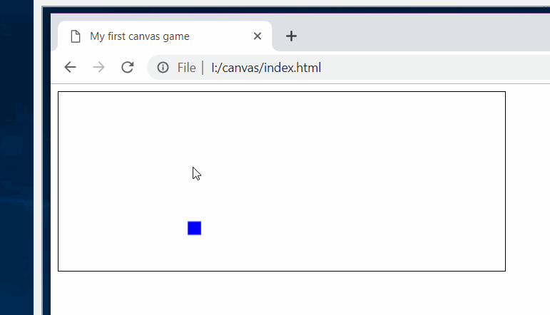

learning Canvas and possibly very basic game physics

following tut from 
http://www.somethinghitme.com/2013/01/09/creating-a-canvas-platformer-tutorial-part-one/comment-page-1/#comment-719870

Plan:

ways to do animation

1. SVG with CSS

2. Canvas with HTML5 and JS

3. React with some canvas framework